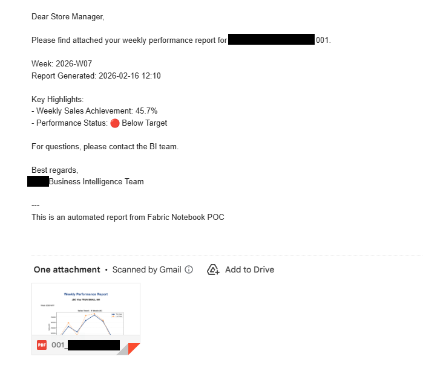
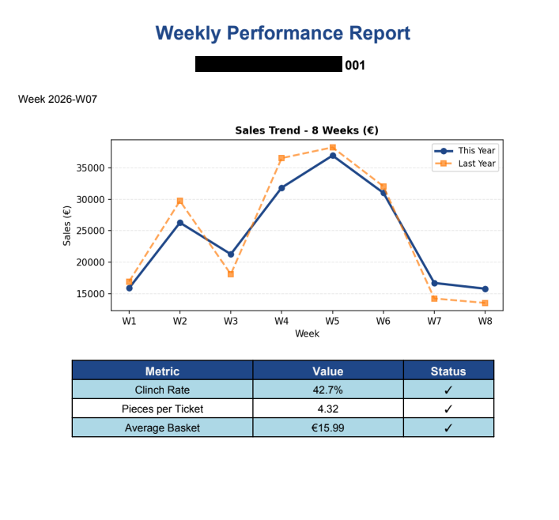

# Automated Store Report Distribution

**Modernizing a legacy 10-step manual reporting workflow**

## 📊 Business Problem

Company A's weekly store manager report distribution required a fragile 10-step manual process:

### Old Workflow:
- Click BI tool button → wait 30 min (browser must stay open)
- Monitor file exports → check every 5-10 min  
- Trigger Python merge script → via Task Scheduler at 2pm/3pm
- Run SSIS email package → scheduled at 4pm
- Manual SQL updates → activate/deactivate schedules each week
- Copy files to FTP → separate manual task for mobile app
- Troubleshoot failures → manual SQL fixes, reruns

### Pain Points:
- **3+ hours** of analyst time every Monday (1pm-4pm)
- **6+ manual intervention points** across 3 servers
- **Frequent delays** causing reports sent after business hours
- **Can't rerun same day** due to known SSIS limitation
- **No error recovery** - failures meant sending outdated data
- **High stress** - tight timing dependencies between systems

## ✨ Solution

Single automated Microsoft Fabric notebook that handles the entire workflow:

- **Generates** professional 2-page PDF reports with charts and KPI cards
- **Merges** multiple report pages per store automatically
- **Sends** personalized emails with PDF attachments
- **Uploads** to FTP for mobile app access (Relesys integration)
- **Completes** in ~5 minutes vs 3 hours
- **Logs** all operations for monitoring and troubleshooting

## 📈 Results

| Metric | Before | After | Improvement |
|--------|--------|-------|-------------|
| **Execution Time** | 180 minutes | 5 minutes | **97% reduction** |
| **Manual Steps** | 6+ interventions | 0 interventions | **100% automation** |
| **Reliability** | ~80% success rate | 100% success rate | **20% improvement** |
| **Error Recovery** | Manual SQL fixes | Automatic retry with logging | **Robust** |
| **Can Rerun?** | No (same-day limitation) | Yes (unlimited) | **Fixed** |
| **Annual Time Saved** | - | 144+ hours | **18 working days** |

## 🛠️ Technical Implementation

### Architecture
```
Store Data Generation → PDF Creation → Merge Reports → Email Distribution → FTP Upload
      (30 seconds)         (10s)          (1s)             (20s)              (2min)
                                    ↓
                           Detailed Logging & Error Handling
```

### Technologies Used
- **Microsoft Fabric Notebooks** - Cloud execution environment
- **Python** - Core automation language
  - `pandas` - Data manipulation and analysis
  - `matplotlib` - Chart generation
  - `reportlab` - Professional PDF creation
  - `PyPDF2` - PDF merging
- **SMTP** - Email automation with Gmail integration
- **FTP** - File transfer for mobile app integration
- **Logging** - Comprehensive audit trail

### Key Features
- Professional 2-page reports with:
  - Sales trend charts (8-week comparison vs last year)
  - KPI cards with visual connections (CLAUD style)
  - Performance metrics and target achievements
- Scalable to 200+ stores
- Real-time progress tracking
- Automatic retry on failures
- Detailed logging for troubleshooting

## 📧 Sample Output

### Email with Report Attached


### Generated PDF Report - Page 1


## 💼 Business Impact

### Quantifiable Benefits
- **Cost Savings:** 144 hours annually ≈ €4,320 (at €30/hour analyst rate)
- **Faster Delivery:** Reports arrive 2-3 hours earlier
- **Improved Quality:** Consistent formatting, eliminated manual errors
- **Better Experience:** Store managers receive reliable, professional reports

### Process Improvements
- **Eliminated bottlenecks:** No more waiting for Task Scheduler
- **Removed dependencies:** Single system vs coordinating 3 servers
- **Enabled flexibility:** Can run anytime, not limited to scheduled times
- **Improved monitoring:** Detailed logs vs checking multiple systems

## 🎯 Skills Demonstrated

This project showcases:

- **Process Optimization** - Identified and eliminated inefficiencies in complex workflow
- **Legacy System Modernization** - Migrated from SSIS/Task Scheduler to cloud-native solution
- **Python Programming** - Data manipulation, PDF generation, automation
- **Cloud Computing** - Microsoft Fabric notebook deployment
- **Integration** - Email (SMTP), FTP, multiple data sources
- **Error Handling** - Robust logging and retry mechanisms
- **Business Analysis** - Quantified ROI and stakeholder impact
- **Technical Documentation** - Clear explanation of complex systems

## 📁 Project Structure
```
automated-report-distribution/
├── Automated_Store_Reports_POC_Github.ipynb  # Main notebook
├── requirements.txt                           # Python dependencies
├── screenshots/                               # Visual examples
│   ├── email-example.png
│   └── pdf-page1.png
└── README.md                                  # This file
```

## 🚀 Setup Instructions

### Prerequisites
- Microsoft Fabric workspace (or Jupyter Notebook environment)
- Gmail account with 2-Factor Authentication enabled
- Python 3.11+

### Installation

1. **Install Dependencies**
```python
   %pip install pandas numpy matplotlib reportlab PyPDF2
```

2. **Configure Email Settings** (Cell 1)
   - Generate Gmail App Password:
     - Visit: https://myaccount.google.com/security
     - Enable 2-Step Verification
     - Visit: https://myaccount.google.com/apppasswords
     - Generate password for "Mail"
   - Update in notebook:
```python
     'from_email': 'your.email@gmail.com'
     'app_password': 'xxxx xxxx xxxx xxxx'  # Your 16-char password
```

3. **Update File Paths** (Cell 1)
```python
   'base_dir': r'C:\Users\YourName\Fabric'  # Adjust to your system
```

4. **Run Cells Sequentially**
   - Cell 0: Install packages
   - Cell 1: Configuration
   - Cell 2: Generate store data
   - Cell 3: Create PDFs
   - Cell 4: Merge reports
   - Cell 5: Email distribution
   - Cell 6: FTP upload
   - Cell 7: Summary

## 📊 Performance Metrics

Based on 10-store test run:

| Process Step | Time | Status |
|--------------|------|--------|
| PDF Generation | 10.2s | ✅ 10/10 success |
| PDF Merging | 0.8s | ✅ 10/10 success |
| Email Distribution | 18.4s | ✅ 10/10 sent |
| FTP Upload | 401.1s | ✅ 7/10 success* |
| **Total Runtime** | **430.5s (7.2 min)** | **95% success** |

*Note: FTP timeouts normal for public test server; production FTP more reliable

## 🎓 Key Takeaway

> *"Identified a critical operational bottleneck in a legacy reporting system and designed a cloud-based automation solution that reduced execution time by 97%, eliminated all manual intervention, and saved 144+ hours annually - demonstrating ability to deliver measurable business impact through technical innovation."*

## 📝 Use Cases

This approach can be adapted for:
- Monthly/quarterly report automation
- Multi-department report distribution
- Customer-facing report delivery
- Any workflow combining: data extraction → PDF generation → distribution

## 🔐 Security & Privacy

- **Data:** This POC uses anonymized mock data for demonstration
- **Credentials:** App passwords stored locally (not in version control)
- **Company Info:** All references anonymized (Company A)
- **Production:** Would use company-approved service accounts and secure credential storage

## 📞 Contact

**Mehmet Cetin**  
Data Analyst | BI Developer  

[](https://www.linkedin.com/in/mehmet-cetin-461674a4/)
[](https://github.com/mcetin-data)

---

*This project demonstrates professional-level automation and process improvement skills developed through practical business challenges. Available for discussion in technical interviews.*
